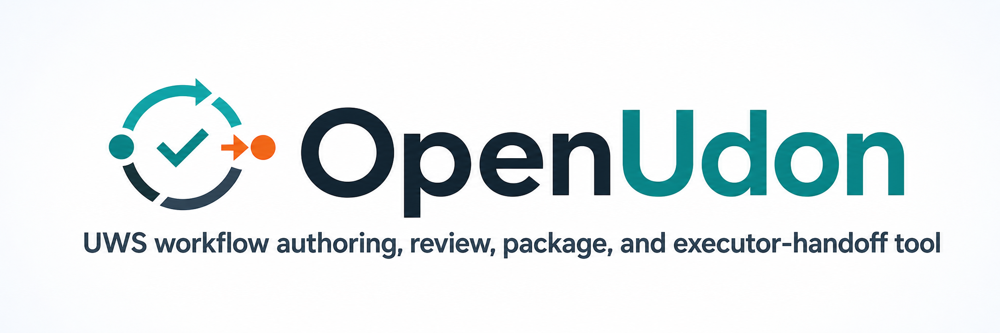

# OpenUdon

<p align="center">
  
</p>

OpenUdon is the public UWS workflow authoring, review, package, and executor-handoff tool. It turns
reviewed project briefs into deterministic workflow packages and hands approved packages to a trusted
executor boundary.

OpenUdon can be used directly by an operator or under optional external orchestration. In
both modes, generated artifacts stay untrusted until validation, review, approval, and package digest
checks pass.

## What OpenUdon Owns

- Project briefs, templates, guided iCoT authoring, and eval fixtures.
- API-source-bound UWS artifact generation from reviewed OpenAPI, Google Discovery, and AWS
  Smithy inputs.
- Review evidence, quality reports, approval templates, package digests, and handoff manifests.
- Local trusted-runner enforcement before invoking an external executor.

OpenUdon does not own public workflow semantics, generic OpenAPI/UWS execution, workflow
state, or concrete infrastructure authoring. Those boundaries are summarized on the
[Related](related.md) page.

## Basic Flow

```text
project.md
  -> workflows/intent.hcl
  -> workflows/workflow.hcl and workflows/workflow.uws.yaml
  -> expected plan, quality, review, and handoff artifacts
  -> approval JSON with package digest
  -> openudon run trusted executor handoff
```

## Operator Commands

```bash
go run ./cmd/icot --example ./examples/<name>
go run ./cmd/openudon synthesize --example ./examples/<name>
go run ./cmd/openudon build --example ./examples/<name>
go run ./cmd/openudon assess --example ./examples/<name>
go run ./cmd/openudon approval-template --example ./examples/<name> --state approved_for_sandbox --reviewer "Reviewer Name"
go run ./cmd/openudon run --example ./examples/<name> --tier sandbox --approval approvals/<name>.json --dry-run
```

Use [Authoring](authoring.md) for the two authoring paths, [iCoT Corpus And Provider Roadmap](icot-corpus-and-provider-roadmap.md)
for the next iCoT reliability direction, [Tutorial](tutorial-weather.md) for fixture-based
walkthroughs, [Enterprise Authoring And Execution Boundary](enterprise-authoring-execution.md) for
the LLM-authoring/deterministic-execution product boundary, [SaaS Operator Release Path](saas-operator-release.md)
for the provider-free release demo, and [Handoff](safety.md) for the review and execution boundary.

## Documentation Index

### Authoring

- [Authoring](authoring.md)
- [Agentic SaaS Authoring](agentic-saas-authoring.md)
- [SaaS Authoring Corpus](saas-authoring-corpus.md)
- [SaaS Authoring Trials](saas-authoring-trials.md)
- [Multi-Service SaaS Patterns](multi-service-saas-patterns.md)
- [n8n Pattern Bridge](n8n-pattern-bridge.md)
- [Project Briefs](project-authoring.md)
- [project.md Schema](project-authoring-schema.md)
- [intent.hcl](intent.md)
- [Data Flow](data-flow.md)
- [iCoT](icot.md)
- [iCoT Corpus And Provider Roadmap](icot-corpus-and-provider-roadmap.md)
- [iCoT Session Files](icot-session-schema.md)
- [iCoT Transcripts](icot-transcript.md)
- [Enterprise Authoring And Execution Boundary](enterprise-authoring-execution.md)
- [Synthesize](synthesize.md)

### Tutorials And Eval

- [Weather Tutorial](tutorial-weather.md)
- [Gmail Audit Receipt Tutorial](tutorial-gmail.md)
- [Order Fulfillment Chain Tutorial](tutorial-order-fulfillment.md)
- [Support Email Tutorial](tutorial-support-email.md)
- [Eval Gallery](eval-gallery.md)
- [Eval Seed/Build Matrix](eval-seed-build-matrix.md)

### Handoff And Release

- [Safety](safety.md)
- [Review Handoff](review-handoff.md)
- [SaaS Review Handoff](saas-review-handoff.md)
- [SaaS Operator Release Path](saas-operator-release.md)
- [Product Smoke Matrix](product-smoke-matrix.md)
- [Terraform/API Source Conversion](terraform-openapi-conversion.md)
- [Release Stewardship](release-stewardship.md)
- [Release Notes Template](release-note-template.md)
- [AWS Provider Conversion Corpus](aws-provider-conversion-corpus.md)

### Related

- [Related Projects](related.md)
